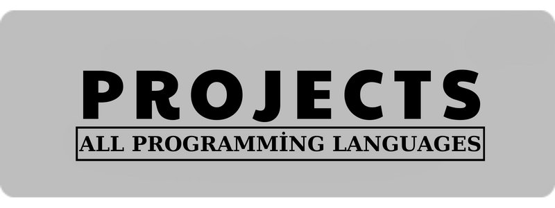
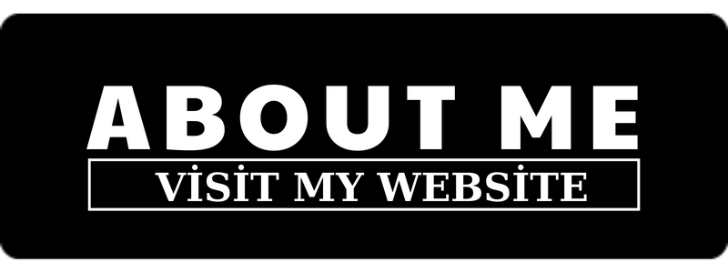

<h2 class="heading-element" dir="auto">Everything is Here</h2><a id="user-content-the-good-the-bad-and-the-ugly" class="anchor" aria-label="Permalink: The Good, the Bad and the Ugly" href="#the-good-the-bad-and-the-ugly"><svg class="octicon octicon-link" viewBox="0 0 16 16" version="1.1" width="16" height="16" aria-hidden="true"><path d="m7.775 3.275 1.25-1.25a3.5 3.5 0 1 1 4.95 4.95l-2.5 2.5a3.5 3.5 0 0 1-4.95 0 .751.751 0 0 1 .018-1.042.751.751 0 0 1 1.042-.018 1.998 1.998 0 0 0 2.83 0l2.5-2.5a2.002 2.002 0 0 0-2.83-2.83l-1.25 1.25a.751.751 0 0 1-1.042-.018.751.751 0 0 1-.018-1.042Zm-4.69 9.64a1.998 1.998 0 0 0 2.83 0l1.25-1.25a.751.751 0 0 1 1.042.018.751.751 0 0 1 .018 1.042l-1.25 1.25a3.5 3.5 0 1 1-4.95-4.95l2.5-2.5a3.5 3.5 0 0 1 4.95 0 .751.751 0 0 1-.018 1.042.751.751 0 0 1-1.042.018 1.998 1.998 0 0 0-2.83 0l-2.5 2.5a1.998 1.998 0 0 0 0 2.83Z"></path></svg></a>

  
  &nbsp;
  
  &nbsp;
  

  
  
  &nbsp;
  
  &nbsp;
  

  
  </a>
  
  </a>

## Hakkımda

- I’m currently studying Common Core at 42 Kocaeli, after successfully completing the Piscine.
- I’m interested in  `Cybersecurity`, `Backend Develepoer` and `Dipigtal Forensics`.

<h2 class="heading-element" dir="auto">Skills</h2><a id="user-content-skills" class="anchor" aria-label="Permalink: Skills" href="#skills"><svg class="octicon octicon-link" viewBox="0 0 16 16" version="1.1" width="16" height="16" aria-hidden="true"><path d="m7.775 3.275 1.25-1.25a3.5 3.5 0 1 1 4.95 4.95l-2.5 2.5a3.5 3.5 0 0 1-4.95 0 .751.751 0 0 1 .018-1.042.751.751 0 0 1 1.042-.018 1.998 1.998 0 0 0 2.83 0l2.5-2.5a2.002 2.002 0 0 0-2.83-2.83l-1.25 1.25a.751.751 0 0 1-1.042-.018.751.751 0 0 1-.018-1.042Zm-4.69 9.64a1.998 1.998 0 0 0 2.83 0l1.25-1.25a.751.751 0 0 1 1.042.018.751.751 0 0 1 .018 1.042l-1.25 1.25a3.5 3.5 0 1 1-4.95-4.95l2.5-2.5a3.5 3.5 0 0 1 4.95 0 .751.751 0 0 1-.018 1.042.751.751 0 0 1-1.042.018 1.998 1.998 0 0 0-2.83 0l-2.5 2.5a1.998 1.998 0 0 0 0 2.83Z"></path></svg></a>

<ul dir="auto">
    <li>💻 Python3 / C / C++ / Web kodlama (HTML, CSS, JavaScript, PHP, MySQL)</li>
    <li>💥 Linux İşletim Sistemi / Windows İşletim Sistemi / Kali İşletim Sistemi</li>
    <li>💪 Kriptografi / Steganografi / Dijital Adli Bilişim / Web Sızma Testi / Tersine Mühendislik / OSINT</li>
    <li>💀 Etik Hackleme / Web Sızma Testi / Temel Ağ Bilgisi / CTF</li>
    <li>👀 Try Hack Me / Hack The Box / Cyber Talents</li>
    <li>🔥 Metasploit / Nmap / Wpscan / Burp-suite / Wireshark / gobuster / dirsearch / Hydra vb.</li>
</ul>

## Yetenekler

  

